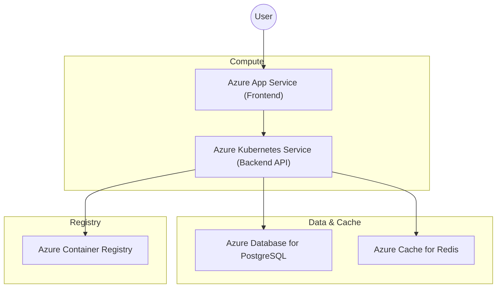

# SCM Application Cloud Architecture

This document provides a technical overview of the Azure infrastructure provisioned for the SCM application. Use this as a reference for understanding how components interact and how to manage costs.

## Architecture Overview

The following diagram illustrates the flow of traffic and connections between Azure services:



## Component Breakdown

### 1. Azure App Service (Frontend)
- **File**: [webapp.tf](file:///Users/jayanandenm/Desktop/ASE/codebase/deployment/terraform/webapp.tf)
- **Purpose**: Hosts the Node.js frontend application.
- **SKU**: `B1` (Basic) - Provides a dedicated environment for consistent performance.
- **Configuration**: Listens on port `3000`.

### 2. Azure Kubernetes Service (AKS)
- **File**: [aks.tf](file:///Users/jayanandenm/Desktop/ASE/codebase/deployment/terraform/aks.tf)
- **Purpose**: Orchestrates the backend services and worker nodes.
- **SKU**: `Standard_B2s` - A burstable VM size used to keep costs low during low activity.
- **Integration**: Has `AcrPull` permissions to automatically download images from ACR.

### 3. Azure Container Registry (ACR)
- **File**: [acr.tf](file:///Users/jayanandenm/Desktop/ASE/codebase/deployment/terraform/acr.tf)
- **Purpose**: Private registry to store Docker images for the backend.
- **SKU**: `Basic`.

### 4. Azure Database for PostgreSQL (Flexible Server)
- **File**: [postgres.tf](file:///Users/jayanandenm/Desktop/ASE/codebase/deployment/terraform/postgres.tf)
- **Purpose**: Relational database for persistent storage.
- **SKU**: `B_Standard_B1ms` (Burstable) - Optimized for development costs.
- **Security**: Configured with firewall rules to allow Azure services and external access (verify for production).

### 5. Azure Cache for Redis
- **File**: [redis.tf](file:///Users/jayanandenm/Desktop/ASE/codebase/deployment/terraform/redis.tf)
- **Purpose**: High-performance caching layer.
- **SKU**: `Basic` (C0).
- **Note**: This resource cannot be "paused" and incurs charges as long as it exists.

## Cost Management

To minimize cloud spend, use the provided scripts to stop resources when not in use (e.g., overnight or weekends).

### Stopping Resources
Run the script to stop AKS, Postgres, and the Web App:
```bash
./stop_az_resources.sh
```
> [!WARNING]
> Redis cannot be stopped. To stop Redis costs, you must `terraform destroy -target=azurerm_redis_cache.redis`.

### Starting Resources
Run the script to bring everything back online:
```bash
./start_az_resources.sh
```

## Security & Connectivity
- **Internal Access**: AKS communicates with ACR using a System Assigned Managed Identity.
- **Database Access**: Postgres is protected by firewall rules. In a production environment, it is recommended to use **VNet Integration** so the database is not exposed to the public internet.

## 🎓 Technology Mastery Learning Path
To become an expert in this deployment stack, follow these guided modules:

1. [**Module 1: Terraform**](file:///Users/jayanandenm/Desktop/ASE/codebase/deployment/terraform/LEARNING_TERRAFORM.md) - Learn how your infrastructure is defined as code.
2. [**Module 2: Containers & ACR**](file:///Users/jayanandenm/Desktop/ASE/codebase/deployment/terraform/LEARNING_CONTAINERS.md) - Master Docker and image management.
3. [**Module 3: Kubernetes & AKS**](file:///Users/jayanandenm/Desktop/ASE/codebase/deployment/terraform/LEARNING_K8S.md) - Understand how your apps are orchestrated.
4. [**Module 4: Managed Data Services**](file:///Users/jayanandenm/Desktop/ASE/codebase/deployment/terraform/LEARNING_DATA.md) - Deep dive into Postgres and Redis.
5. [**Module 5: Automation**](file:///Users/jayanandenm/Desktop/ASE/codebase/deployment/terraform/LEARNING_AUTOMATION.md) - Professional maintenance and CLI mastery.
